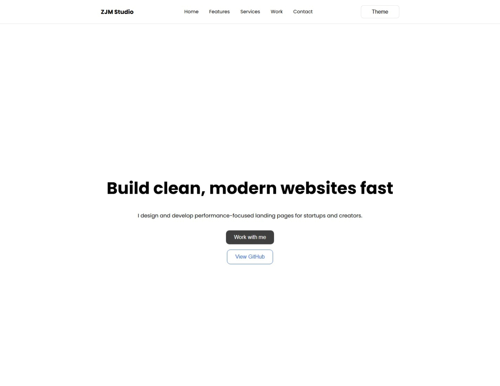

# LP-01 · Product Landing Page

A clean and responsive landing page built with HTML, CSS and a lightweight component structure.  
Designed for clarity, fast loading and real-world use in product or service presentation.

🔗 **Live Demo:** https://vanta-zjm.github.io/landing-page-01/

---

## ✅ Features
- Responsive layout (mobile-first)
- Dark & Light theme switch
- Reusable layout sections
- Minimal and readable code structure
- Production-ready asset organization
- Smooth hamburger menu interaction

---

## 🛠 Tech Stack
| Category | Tools |
|----------|-------|
| Markup | HTML5 |
| Styling | CSS3 (variables, grid) |
| Interaction | Vanilla JavaScript |
| Version Control | Git + GitHub Pages |

---

## 📸 Preview
> LP-01 - Homepage (Hero Section)

  
---

## 🚀 Sections
- Hero
- Features
- Services
- Work Portfolio
- Trust Signals
- Process
- About
- CTA
- Footer

---

## 📦 Version History
| Version | Status | Notes |
|----------|--------|--------|
| v0.1 | ✅ Init | Basic layout |
| v0.3 | ✅ Structure | Sections + layout |
| v0.6 | ✅ Trust block | First trust layer |
| v0.7 | ✅ Portfolio | Case preview integrated |
| v1.0 | ✅ Release | Fully ready project version |

---

## 🔓 License
This project is open-source and available under the MIT License.

---

### 👨‍💻 Author
Built by **张津铭 (Vanta)**  
Open to collaboration and freelance work — contact coming soon.

